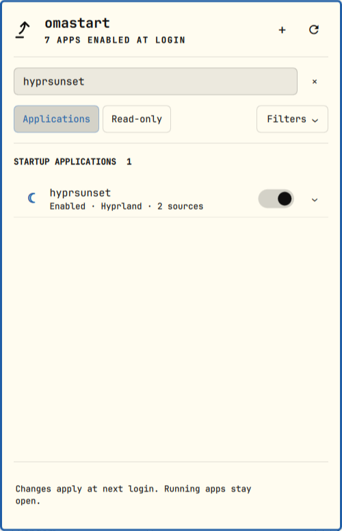

# omastart

**Manage everything that starts with your Omarchy session.**

A native Omarchy Quattro startup-apps panel that brings Hyprland, XDG
autostart, and user systemd into one searchable application list.



- **Plugin ID:** `io.github.pablousx.omastart`
- **Author:** pablousx
- **Version:** 0.1.0
- **License:** MIT

## Use

Click the launch-arrow bar widget. **All apps**, **Enabled**, and **Disabled**
select a view directly. Search by application, command, path, or startup source;
the clear button returns you to the list. **Filters** contains source choices
and **Include system items**. Active filters remain visible when collapsed,
and **Reset filters** clears them in one step.

Switches save a specific startup source. The affected row shows **Saving…**
until the confirmed configuration comes back. A message names the app and
result, with **Undo** for a reversible change. Undo pauses its dismissal while
you hover or focus the message and becomes unavailable if the source changes
elsewhere. Failed saves keep the previous displayed state and offer Refresh.

Click an app or its chevron for source controls. Apps with several independent
sources expose each separately; turning one off reports if another remains
enabled. **Why?** explains read-only items. Commands, paths, and running-state
metadata sit behind **Technical details**. Generated XDG systemd units belong
to their desktop entry and are never counted or edited twice.

**Add app** searches installed desktop applications. Choose **Add** to copy an
entry to your user autostart directory, preserving its command and actions.
The picker stays open so you can add several apps. Existing entries offer
**Manage**, which opens their startup settings. **Back** restores your previous
search, filters, selection, and scroll position. No app is launched by the picker.

The panel keeps a stable size during searches and updates. Expanding a row
brings its controls into view; background refresh preserves your list position.
Empty results explain what happened and offer a relevant action.

Keyboard interaction:

- **Ctrl+F** focuses and selects the search text; **Tab** moves between controls.
- **Down** enters the list; **Up** from the first row returns to search.
- **Enter** from search chooses the first result. In the list, **Enter/Space**
  expands an app, adds a picker choice, or manages an existing picker entry.
- **Left/Right** collapses or expands the selected app; focused switches use
  **Space/Enter** to change their setting.
- **Escape** clears search, returns from the picker, collapses details or
  filters, then closes the panel, in that order.

The status means configured to start at login. Running apps stay open when you
change a setting. Infrastructure is hidden by default and remains protected
when shown. Unsupported entries explain their limits in expanded details.

## Requirements

- Omarchy Quattro; developed against Omarchy 4.0.3-1 and its bundled Quickshell.
- Python 3.10 or newer (standard library only).
- `systemctl` with JSON unit-file listing support, and an accessible user bus.
- `luac` for syntax-only validation of Hyprland edits.
- Omarchy's native `qs.Ui` and `qs.Commons` modules.

No privileged operations, package installation, or external network service is
required. omastart is independent of `smartalb.autostart` and does not modify it.

## Local installation

From the source directory, as your normal desktop user:

```sh
python3 -m unittest discover -v
python3 scripts/test_qml.py
python3 scripts/check_qml.py
omarchy plugin validate .
python3 scripts/install.py
omarchy-shell shell summon io.github.pablousx.omastart '{}'
```

The installer copies a validated snapshot into
`~/.config/omarchy/plugins/io.github.pablousx.omastart`, rescans the shell, and
enables the widget in the left section. It backs up the previous plugin and
`shell.json` under `~/.config/omarchy/omastart-install-backups/`. It creates no
Git remote and invokes no plugin install hooks. Re-run it to deploy local edits;
existing widget placement is preserved. Installed runtime files use a content
hash in their path so Quickshell cannot retain stale compiled QML on update.

To remove the widget without changing startup preferences:

```sh
omarchy plugin disable io.github.pablousx.omastart
```

To uninstall its files, use Omarchy's plugin removal UI or
`omarchy plugin remove io.github.pablousx.omastart --yes`. Startup preferences
and recovery backups persist independently of the plugin. Restore any desired
startup preferences before uninstalling.

## Supported startup mechanisms

| Mechanism | Discovery | Changes |
| --- | --- | --- |
| Hyprland | User `autostart.lua`, literal calls and inspectable unsupported startup statements | Comment/uncomment standalone top-level `o.launch_on_start` and `o.exec_on_start` literal calls; validate syntax before atomic replacement |
| XDG | User/system autostart precedence, desktop eligibility, generated-unit association | Preserve desktop contents and use per-user `Hidden` overrides; reverse omastart changes without rewriting system files |
| User systemd | Graphical targets and enabled user applications attached to `default.target`; global and user links | Manage ordinary per-user enablement links; use a per-user mask to disable global enablement |

XDG locations honor `XDG_CONFIG_HOME`, `XDG_CONFIG_DIRS`, `XDG_DATA_HOME`, and
`XDG_DATA_DIRS`, including installed Flatpak and Snap desktop exports. Desktop
eligibility honors `OnlyShowIn`, `NotShowIn`, `TryExec`, and the systemd XDG
generator's skip/phase rules. `NoDisplay` does not mean startup is disabled.
GNOME's `X-GNOME-Autostart-enabled` is not the systemd generator's enablement
switch; omastart writes the standard `Hidden` key.

Application identity comes from installed desktop metadata, parsed executable
names, and narrow mappings for known applications such as Synergy. Different
interpreter commands are not merged merely because they share an interpreter.

## Safety and recovery

Configuration edits are per-user. No files under `/usr`, `/etc`, or
`/usr/share/omarchy` are written. Commands are passed as argument arrays;
startup commands and Lua configuration are never executed by the backend.

Every change takes a process lock, rescans its source, checks the displayed
revision, and journals the original file bytes or symlink before changing it.
Files use same-directory temporary files, `fsync`, and atomic replacement.
The journal preserves file modes. Symlinked files and parent directories that
would make an edit ambiguous are read-only.

Backups live under `$XDG_STATE_HOME/omastart/transactions` (by default
`~/.local/state/omastart/transactions`) as private JSON records. File contents
are base64-encoded; symlink targets are recorded verbatim. They may contain
private startup command arguments, so do not publish them.

An ordinary failure rolls back only content still matching what omastart wrote.
Concurrent external edits are preserved and reported. Interrupted transactions
remain recorded for recovery. **Undo last change** restores a source's latest
backup when it still matches the current configuration. An interrupted change
offers **Restore interrupted change** when its files can safely be restored;
otherwise it explains that external edits need review. Further startup changes
are blocked until that interrupted transaction is resolved. Never blindly copy
a backup over newer changes.

Changes affect future logins. omastart never issues service start, stop,
restart, or `--now`. Updating XDG entries or systemd enablement reloads manager
metadata, so XDG units are regenerated even with a lingering user manager.
Running applications are not restarted. A per-user mask also prevents later manual or indirect
starts of that service until it is restored. Hyprland may automatically reload
its configuration when a file changes; Omarchy's startup callbacks run at
session startup, not at configuration reload.

## Deliberate limits

- Arbitrary Lua, computed arguments, and conditional startup blocks are
  inspectable but not editable. The shipped commented `my-service` example is
  classified as a protected template, not an installed app.
- Socket/timer activation, service templates, runtime-only activation, aliases,
  required dependencies, specifiers, and service drop-ins are protected.
- An externally created mask is not silently removed. A global service with
  an existing local unit file is protected if masking would overwrite it.
- Conditional XDG entries are shown without executing their conditions.
- Infrastructure and uncertain packaged services remain protected; there is
  no “unlock everything” switch.
- Process activity is reported when systemd provides it. Lua startup does not
  imply that a matching process is still running.
- Login-shell scripts, arbitrary Omarchy hooks, and application-internal
  startup preferences are outside this version's three-provider model.

## Tests and validation

`python3 -m unittest discover -v` builds disposable HOME/XDG fixtures and uses
an injected fake systemd runner. The only real helper used by mutation tests
is `luac -p -`, receiving fixture text on stdin. Tests never contact the real
user manager or edit real startup files.

`python3 scripts/test_qml.py` loads the actual panel and row components in a
separate offscreen Quickshell process, with fixture data and **no backend
present**. A geometry adapter replaces only the Wayland window container,
which has no offscreen backend; all other native controls remain in use.
Installed-shell acceptance separately verifies the real `KeyboardPanel`.

`python3 scripts/check_qml.py` resolves Omarchy imports in a temporary analysis
directory. `omarchy plugin validate .` is the official manifest validator.
The QML checker reports known dynamic Omarchy facade/type-metadata diagnostics
separately; runtime tests cover these members. Unexpected diagnostics fail.

For read-only live diagnostics:

```sh
python3 backend/omastart.py
omarchy-shell io.github.pablousx.omastart inspect
python3 scripts/capture_startup.py
```

The backend prints JSON. Capture fingerprints before and after live acceptance
to verify startup files and links stayed unchanged. The plugin's IPC methods
only inspect, search, filter, expand, and refresh the UI; they do not toggle apps.

`python3 scripts/verify_live.py` explicitly opens and captures the panel on each
connected display, checks Vicinae, Synergy, and hyprsunset, inspects protected
items, and compares startup fingerprints. It never invokes a startup toggle.
Its local report and per-display screenshots are written to `.verification/`;
the cropped main-panel capture becomes `preview.png`. It is not part of the
isolated test command and is intended for this machine's acceptance run.

## Project website

The responsive landing page, privacy policy, and terms of service are in
[`docs/`](docs/README.md). Preview them locally with:

```sh
python3 -m http.server 8000 --bind 127.0.0.1 --directory docs
```

GitHub Pages can publish `main` → `/docs` with no build step. The site includes
a downloadable source snapshot; refresh it with
`python3 scripts/build_site_download.py` after changing the plugin. See the
[website guide](docs/README.md) for publishing and maintenance details.
